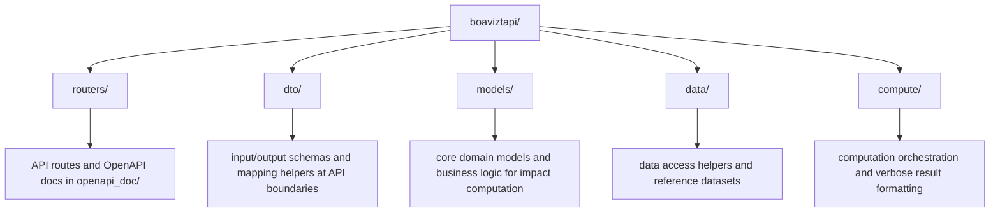
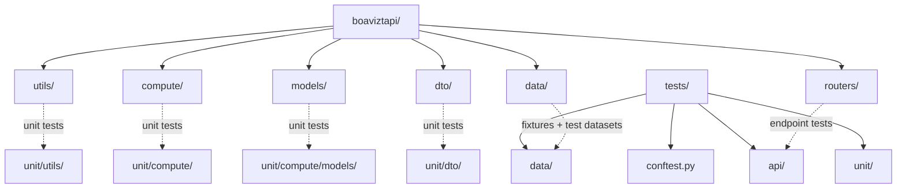

# Contribution tl;dr

Check this points if you want to do a pull request :

 * [ ] Is my code written in [PEP8](https://www.python.org/dev/peps/pep-0008/)?
 * [ ] Are the tests passing (`make test`)?
 * [ ] Is my feature or bug fix unit tested?
 * [ ] Does each of my commits represent an atomic functionality or bug fix?
 * [ ] Is my feature or bug fix related to an issue?
 * [ ] Are the pre-commit checks set up and passing (`make pre-commit-install pre-commit`)?

# Code organization

We tried to keep the code organization as simple as possible. Here is an overview of the main folders:

# Tests organization

The test tree mirrors the source tree. Add new tests in the matching folder so navigation stays predictable.

Some rules:

* Add as many tests as possible when contributing. For example, if you are fixing a bug, add the bug report as a new test case.
* For a source module under `boaviztapi/<area>/...`, create tests under `tests/unit/<area>/...`. 
* API behavior for routers belongs in `tests/api/`.
* Test-only datasets and fixtures go in `tests/data/`.
* Keep test filenames aligned with source behavior (for example `test_<feature>.py`).
