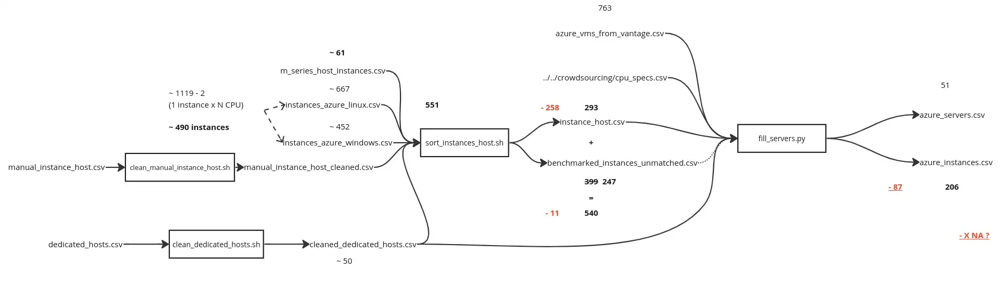

# Completing and updating Azure VMs data

## Sponsoring

We'd like to thank [GreenPixie](https://greenpixie.com/) who sponsored this PR.

## Source data

1. Get benchmark data matching instance type to physical CPU : https://learn.microsoft.com/en-us/azure/virtual-machines/linux/compute-benchmark-scores and https://learn.microsoft.com/en-us/azure/virtual-machines/windows/compute-benchmark-scores, save as `instances_azure_linux.csv` and `instances_azure_windows.csv`
2. Get dedicated_hosts.csv from https://azure.microsoft.com/en-us/pricing/details/virtual-machines/dedicated-host/ (Copy paste the table in libreoffice benefiting from automatic column filling, remove last two columns "1 year savings plan,3 year savings plan" then export in csv), then run `clean_dedicated_hosts.sh > cleaned_dedicated_hosts.csv`
3. Get Azure VMs data from vantage `azure_vms_from_vantage.csv` from : https://instances.vantage.sh/azure/
4. Get data from tables in each [Dedicated Host documentation page](https://learn.microsoft.com/fr-fr/azure/virtual-machines/dedicated-host-general-purpose-skus) manually (or by scraping, if you wan to contribute), save it as or update `manual_instance_host.csv`

## Workflow

Then, we (as of now) manually update the Azure specific servers/platforms in data/archetypes/server.csv and instances in data/archetypes/cloud/azure.csv.

Next, run a local version of BoaviztAPI by running `docker build -t boaviztapi-dev . && docker run -p "5000:5000" -t boaviztapi-dev` at the root of the project, building the container with the freshly generated data.

Next, run the `generate_impact_azure.py` script, in the data/utils/complete_Azure/VMs folder (this one), to get the new generated result.csv file.

## Hypothesis, choices and caveats

- We tried to get the widest instance families coverage possible, mixing data from several places in Microsoft Azure documentation and vantage website. While this seems a nice approach to be as complete as it can be, this may lead to incoherent data and mistakes while mixing data from different source for the same instance or physical host.
- As Microsoft provides "Dedicated Hosts" that you could rent as the hardware platforms of the virtual machines you consume on Azure, we used this list of host as our bare-metal platforms pool, and tried to map each instance to a host at least. When we didn't have an explicit match, we used the CPU reference found in benchmark data for a given instance, to match one of those hosts nevertheless. This probably hides part of the truth behind the scene, as some instances are not explicitely said to be on a given host and we matched them to dedicated hosts anyway.
- Bursts and overcommit are not accounted for, as the scripts in their current form only extract the number of vCPUs for each instance, without considering if this instance is a burstable instance. Fixing this would mean to extract informations about burst conditions for each instance and change the value of vcpus accordingly (or rely on a mecanism in BoaviztAPI that doesn't exist today).
- For GPUs (concerning NVv3 and NVv4 series): GPU units and memory for the hosts are established by matching the number of vCPUS for an instance and the number of vCPUS for the host, and establishing the potential number of GPUs in the host with the documentation for the instances.
- Current version of the API doesn't account for remote storage. A share of the impacts of local hardware storage is allocated to the virtual machine, which makes sense. In the case of Azure data, we don't have the actual stoarage hardware and volume available for Dedicated Hosts / Bare metal machines. It means that current version of the impacts calculated by the API for Azure is **underestimated** regarding impacts of storage, as we don't account neither for remote storage nor for local storage.

## TODO

- [ ] GPU allocated to virtual machines are not properly filled, fis this
- [ ] update references count alongside the workflow to identify data losses
- [ ] Remove double references to the same instance aggregated in fill_server.py
- [ ] Update with dasv6 instances
- [ ] Update with A and B instances missing
- [x] Add SSD/HDD basic hypothesis for platforms (underlying servers and infrastructure) in servers.csv

## Sources / To-read-list

- [https://azure.microsoft.com/en-us/pricing/details/virtual-machines/series/](https://azure.microsoft.com/en-us/pricing/details/virtual-machines/series/)
- [B series blog post](https://azure.microsoft.com/en-us/blog/introducing-b-series-our-new-burstable-vm-size/)
- [Informations about storage capacity and performance](https://learn.microsoft.com/fr-fr/azure/virtual-machines/disks-scalability-targets)
- [FinOps calculations useful for CPU allocation hypothesis ?](https://singhkays.medium.com/understanding-the-azure-b-series-and-cpu-credits-cd6ad1c46094)
- [List of available dedicated hosts](https://azure.microsoft.com/en-us/pricing/details/virtual-machines/dedicated-host/#resources)
