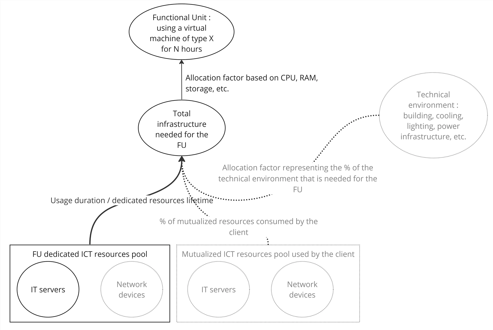

# Azure Impacts results generated by BoaviztAPI

This is the documentation regarding the data in `results.csv`, generated by the BoaviztAPI, based on data aggregated in April 2024 for Microsoft Azure cloud instances.

In this document the word "phase" as in "lifecycle phase" regarding the lifecycle of a digital product or service, following the ISO 14040. Those phases are : raw material extraction, manufacturing, transport, use and end of life.

**Warning: this document details the perimeter covered by BoavitAPI's calculations, this is true at the moment this file it written, it should be updated when the API gets updated with new features !**

## Columns reference

`gwp_manufacturing_1h_impact`: **G**lobal **W**arming **P**otential footprint, for the manufacturing and raw materials extraction phases, estimated by the API, with an allocation of the impact for 1h runtime, considering the ratio `duration` / `server_lifetime` (see the[API's documentation](https://doc.api.boavizta.org/Explanations/embedded_methodology/)), in **kgC02eq**

Embedded impacts returned per instance are a sub allocation of the bare metal server embedded impacts. The formulas used for this allocation are described [in the API documentation](https://doc.api.boavizta.org/Explanations/services/cloud/#method).

`gwp_manufacturing_total_impact`: GWP "embedded" footprint (raw materials extraction and manufacturing phases), estimated for a given instance, assuming that this instance is up and running for the full lifetime of the bare metal platform. 

Use phase energy consumption and GWP footprint are calculated, depending on the CPU load percentage hypothesis and the usage location.

Energy consumption columns follow the naming convention `energy_1h_loadX`, **X** being the CPU time usage percentage hypothesis.

Global Warming Potential footprint on the use phase is reported in the columns following the naming pattern `gwp_use_1h_loadX_Y`, **X** being the CPU time usage percentage hypothesis, **Y** being the usage location in the form of a three-letter code, like **GBR** for Great Britain, **FRA** for France, **USA** for the United States etc.. You can find the available country codes [in the columns of this table](https://github.com/Boavizta/boaviztapi/blob/main/boaviztapi/data/crowdsourcing/electrical_mix.csv).

**Lifetime hypothesis** for bare metal hosts is of 52560 hours / 6 years. According to latest news, Azure extended servers lifetime from 4 to 6 years. (https://www.networkworld.com/article/971373/microsoft-extends-azure-server-lifetimes-by-50.html).

For example:

- `energy_1h_load0`:  reports the estimated energy consumption attributed to a given instance, running 1h, in IDLE state / CPU time usage being close to 0%
- `energy_1h_load50`: reports the estimated energy consumption attributed to a given instance, running 1h, in an active state with CPU time usage being about 50%
- `energy_1h_load100`: reports the estimated energy consumption attributed to a given instance, running 1h, in an active state with CPU time usage being about 100%
- `gwp_use_1h_load0_FRA`: reports the estimated greenhouse gas emissions attributed to a given instance, in an IDLE state / CPU time usage being close to 0%, in France
- `gwp_use_1h_load0_GBR`: reports the estimated greenhouse gas emissions attributed to a given instance, in an IDLE state / CPU time usage being close to 0%, in the United Kingdom

## Perimeter covered

### Infrastructure accounted for

BoaviztAPI, as of now, only accounts for the share of impacts related to the underlying hardware platform, dedicated to the service (in our case the bare metal hosts supporting the cloud instances).

In a life cycle approach, a share of the mutualized infrastructure, necessary for this service to be proposed, should be accounted for as well.

The drawing below shows what parts of the perimeter are included in the API calculation (in black and plain lines) and what parts are not (in grey and dotted lines). Those parts should be implemented in the API in near to middle future, stay tuned and update the generate_azure_impacts scritp if needed, as well as this documentaiton.

### GPUs

The data gathered for cloud provider do include GPUs, as it is intended to provide both embedded and operational impacts for those components in BoaviztAPI.

However, those features are not merged yet, so the results found in results.csv won't include them.

You can follow those ongoing isses on Github to keep track of the evolution regarding those features: for [use phase](https://github.com/Boavizta/boaviztapi/issues/150), for [embedded impacts](https://github.com/Boavizta/boaviztapi/issues/65).

### Storage

BoaviztAPI doesn't provide calculations for "remote" storage (storage services accessed through network, like block storage "EBS" at AWS).

This is in the roadmap and [should be implemented in the following months](https://github.com/Boavizta/boaviztapi/issues/143).

For now, the instances storage amount you will find in [azure.csv]() are made of : SSD storage space bundled in the instance bill line (when announced as such in the documentation) + directly and locally attached NVMe storage (especially L instances families, optimized for storage).

For the SSD storage space bundled with the instance, this is probably underestimated, as we don't properly model the storage service, that includes most probably much more than just hard drives.

Instances that only rely on remote storage (as described in the documentation) are accounted with a storage space of 0. You can identify those instances looking at the verbose part of BoaviztAPI's responses, there shouldn't be any SSD-1 or HDD-1 key in the verbose dictionnary.

## Impact criterias and life cyccle phases covered

Here are the environmental impact categories presented in result.csv and the life cycle steps accounted for.

Increasing this list only requires to edit the generate_azure_impacts.py script to fill the file with more impact categories (16 are available).

- Green House Gaz emissions / Global Warming Potential (see GHG protocol as a reference)
    - resources extraction (LCA) / scope 3 (GHG protocol) ✔️
    - use (LCA) / scope 2 (GHG protocol) ✔️
    - manufacturing (LCA) / scope 3 (GHG protocol) ✔️
    - shipping (LCA) / scope 3 (GHG protocol) ❌
    - end of life (LCA) / scope 3 (GHG protocol) ❌

At the moment we write those lines, [end-of-life impacts are not covered by BoaviztAPI](https://doc.api.boavizta.org/Explanations/embedded_methodology/), so this results file does not include them neither.
