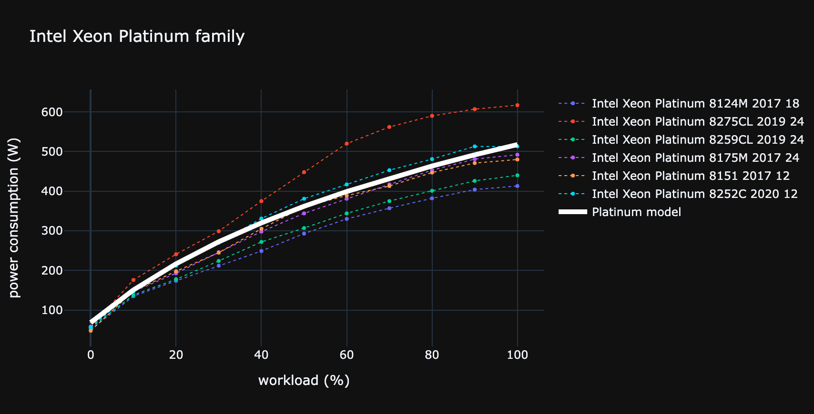
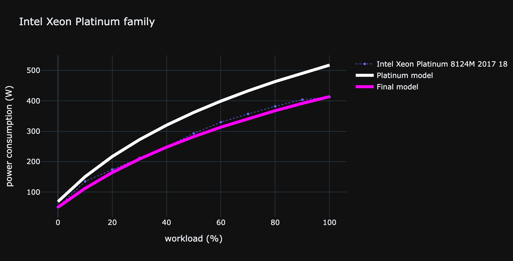

# CPU

## Characteristics

| Name              | Unit | Default value (default;min;max) | Description                                   | Example            |
|-------------------|------|---------------------------------|-----------------------------------------------|--------------------|
| units             | None | 1;1;1                           | CPU quantity                                  | 2                  |
| usage             | None | See Usage                       | See usage                                     | ..                 |
| core_units        | None | 24;1;64                         | Number of physical core on one CPU            | 12                 |
| die_size          | mm2  | None                            | Size of the die                               | 1.1                |
| embedded          | None | None                            | Name of the CPU embedded                      | AMD                |
| die_size_per_core | mm2  | None                            | Size of the die divided by the number of core | 0.245              |
| model_range       | None | None                            | Name of the cpu range or brand                | i7                 |
| family            | None | None                            | Name of the architectural family (Generation) | Skylake            |
| name              | None | None                            | Complete commercial name of the CPU           | Intel Core i7-1065 |
| tdp               | Watt | None                            | Thermal Design Point                          | 250                |


## Complete

**The following [completion](../auto_complete.md) strategies can be used**

### Completion from CPU ```name```

If CPU ```name``` is given, ```model_range```, ```tdp```, ```die_size``` and ```family``` can be retrieved from a fuzzy matching on our cpu name repository. 

!!!warning
    Note that the cpu name repository is not complete and the completion can return a different cpu than the one given by the user. You can set a threshold for the fuzzy matching in the [config file](../../Reference/config.md) to control the behavior of the fuzzy matching.

### Completion of the ```die_size``` from ```family``` and/or ```core_units```

if ```die_size_per_core``` and ```core_units``` are given :

$$ \text{die_size} = {\text{core_units}}*{\text{die_size}}$$

Otherwise, if ```family``` is given, ```die_size``` can be retrieved from a fuzzy matching on our cpu repository. 

If several cpu matches the given ```family```, we use the ```core_units``` attributes : 
* If ```core_units``` matches one to many cpu, the average value is given and min and max value are used as ```min``` and ```max``` fields.
* If ```core_units``` does not match any cpu, we infer the ```die_size``` with a rule of three or a linear regression (when multiple cpus are available).
* If ```core_units``` is not provided, the average value is given and min and max value are used as ```min``` and ```max``` fields.

## Embedded impacts

### Impacts criteria

| Criteria | Implemented | Source                                                                                                                                                         | 
|----------|-------------|----------------------------------------------------------------------------------------------------------------------------------------------------------------|
| gwp      | yes         | [Green Cloud Computing, 2021](https://www.umweltbundesamt.de/sites/default/files/medien/5750/publikationen/2021-06-17_texte_94-2021_green-cloud-computing.pdf) |
| adp      | yes         | [Green Cloud Computing, 2021](https://www.umweltbundesamt.de/sites/default/files/medien/5750/publikationen/2021-06-17_texte_94-2021_green-cloud-computing.pdf) |
| pe       | yes         | [Green Cloud Computing, 2021](https://www.umweltbundesamt.de/sites/default/files/medien/5750/publikationen/2021-06-17_texte_94-2021_green-cloud-computing.pdf) |
| gwppb    | no          |                                                                                                                                                                |
| gwppf    | no          |                                                                                                                                                                |
| gwpplu   | no          |                                                                                                                                                                |
| ir       | no          |                                                                                                                                                                |
| lu       | no          |                                                                                                                                                                |
| odp      | no          |                                                                                                                                                                |
| pm       | no          |                                                                                                                                                                |
| pocp     | no          |                                                                                                                                                                |
| wu       | no          |                                                                                                                                                                |
| mips     | no          |                                                                                                                                                                |
| adpe     | no          |                                                                                                                                                                |
| adpf     | no          |                                                                                                                                                                |
| ap       | no          |                                                                                                                                                                |
| ctue     | no          |                                                                                                                                                                |
| ctuh_c   | no          |                                                                                                                                                                |
| ctuh_nc  | no          |                                                                                                                                                                |
| epf      | no          |                                                                                                                                                                |
| epm      | no          |                                                                                                                                                                |
| ept      | no          |                                                                                                                                                                |

### Impact factors

For one CPU the embedded impact is:

$$ 
\text{CPU}_\text{embedded}^\text{criteria} = (\text{CPU}_{\text{core_units}} * \text{CPU}_{\text{die_size_per_core}} + 0.491 ) * \text{CPU}_\text{embedded_die}^\text{criteria} + \text{CPU}_\text{embedded_base}^\text{criteria}
$$

with:

| Constant                                         | Units       | Value    |
|--------------------------------------------------|-------------|----------|
| $\text{CPU}_\text{embedded_die}^{\text{gwp}}$    | kgCO2eq/cm2 | 1.97     |
| $\text{CPU}_\text{embedded_die}^{\text{adp}}$    | kgSbeq/cm2  | 5.80E-07 |
| $\text{CPU}_\text{embedded_die}^{\text{pe}}$     | MJ/cm2      | 26.50    |
| $\text{CPU}_\text{embedded_base}^{\text{gwp}}$   | kgCO2eq     | 9.14     |
| $\text{CPU}_\text{embedded_base}^{\text{adp}}$   | kgSbeq      | 2.04E-02 |
| $\text{CPU}_\text{embedded_base}^{\text{pe}}$    | MJ          | 156.00   |

!!!info
    If there are more than 1 CPU we multiply $\text{CPU}_\text{embedded}^\text{criteria}$ by the number of CPU given in `units`.

## Usage impacts

Both [power consumption](../usage/elec_conso.md) and [consumption profile](../consumption_profile.md) are implemented.

## Consumption profile

The CPU consumption profile is of the form : ```consumption_profile(workload) = a*ln(b+(workload*c))+d```

### Determining the parameters

#### From model range

If ```model_range``` is given or is completed from the ```cpu_name```, we use the averaged parameter for the specific model range.

| embeddedr    | model_range   | a                 | b                    | c                  | d                   |
|--------------|---------------|-------------------|----------------------|--------------------|---------------------|
| Intel        | xeon platinum | 342.3624349628362 | 0.034750819765533035 | 36.89522616719806  | -16.402219089443307 |
| Intel        | xeon gold     | 71.13767381183924 | 0.2280562153242743   | 9.66939980437224   | 6.266004455550223   |
| Intel        | xeon silver   | 41.55884200277906 | 0.2805828410398358   | 8.424085900547572  | 4.764407035404158   |
| Intel        | xeon e5       | 97.83350026272564 | 0.10296318761911205  | 15.726228837967518 | -1.8588498922070307 |
| Intel        | xeon e3       | 342.3624349628362 | 0.034750819765533035 | 36.89522616719806  | -16.402219089443307 |
| Intel        | xeon e        | 55.65014194649273 | 0.04666041377084888  | 20.41458697644834  | 4.243652609400892   |

By default, we use the consumption profile of **Intel Xeon Platinum**

<TODO: fix consumption profile graphs>


#### Model adaptation from punctual measurement

In case punctual power measurement (load;power_consumption) are given by a user, we adapt the selected consumption
profile to match the given point.

<TODO: fix consumption profile graphs>


#### Model adaptation from TDP

If the TDP is given we use the average power consumption per unit of TDP (given by TEADS) multiplied by the given TDP as power measurement and compute a model adaptation as describe above. 

| 0%   | 10%  | 50%   | 100%   |
|------|------|-------|--------|
| 0.12 | 0.32 | 0.75  | 1.02   |
*Average power consumption per unit of TDP*

