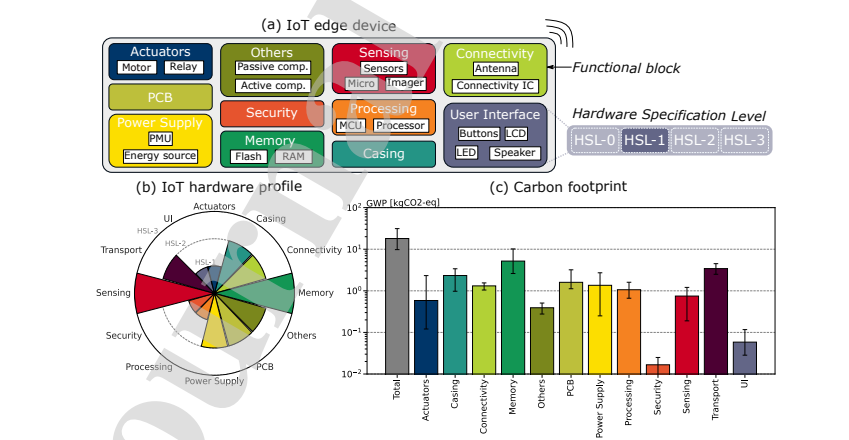

# Functional block

!!!warning
    Connected object, not including associated digital services (use of network, datacenter, virtual machines or other terminals not included)

!!!warning
    The impacts of distribution is not included in the functional block.

## Characteristics

| Name      | Unit     | Default value                                              | Description                                                                                                                         | Example |
|-----------|----------|------------------------------------------------------------|-------------------------------------------------------------------------------------------------------------------------------------|---------|
| hsl_level | (None)   | See [functional block](../components/functional_blocks.md) | "The hardware specification level (HSL) gives details about the hardware available within a functional block." (Pirson & Bol, 2021) | HSL-1   |

hsl_level is described in the following table for each functional block.

## Embedded impacts

We use the screening approach proposed by Pirson and Bol in : ['Assessing the embodied carbon footprint of IoT edge devices with a bottom-up life-cycle approach', 2021; Thibault Pirson et David Bol (Université catholique de Louvain, ICTEAM/ECS, Louvain-la-Neuve, Belgique)](https://doi.org/10.1016/j.jclepro.2021.128966).
Each functional block can be described by its hardware specification level (hsl_level).

We invite you to read the paper for more details. This approach was initially designed for gwp. It has been adapted to other impacts criteria by TIDE.

### Impacts criteria

| Criteria | Implemented | Source                                                                                                                                                                                                                                                                                                                                | 
|----------|-------------|---------------------------------------------------------------------------------------------------------------------------------------------------------------------------------------------------------------------------------------------------------------------------------------------------------------------------------------|
| gwp      | yes         | Adapted by [Tide](https://www.linkedin.com/company/tide-env/) from ['Assessing the embodied carbon footprint of IoT edge devices with a bottom-up life-cycle approach', 2021; Thibault Pirson et David Bol (Université catholique de Louvain, ICTEAM/ECS, Louvain-la-Neuve, Belgique)](https://doi.org/10.1016/j.jclepro.2021.128966) |
| adp      | no          |                                                                                                                                                                                                                                                                                                                                       |
| pe       | yes         | Adapted by [Tide](https://www.linkedin.com/company/tide-env/) from ['Assessing the embodied carbon footprint of IoT edge devices with a bottom-up life-cycle approach', 2021; Thibault Pirson et David Bol (Université catholique de Louvain, ICTEAM/ECS, Louvain-la-Neuve, Belgique)](https://doi.org/10.1016/j.jclepro.2021.128966) |
| gwppb    |             |
| gwppf    | no          |                                                                                                                                                                                                                                                                                                                                       |
| gwpplu   | no          |                                                                                                                                                                                                                                                                                                                                       |
| ir       | yes         | Adapted by [Tide](https://www.linkedin.com/company/tide-env/) from ['Assessing the embodied carbon footprint of IoT edge devices with a bottom-up life-cycle approach', 2021; Thibault Pirson et David Bol (Université catholique de Louvain, ICTEAM/ECS, Louvain-la-Neuve, Belgique)](https://doi.org/10.1016/j.jclepro.2021.128966) |
| lu       | yes         | Adapted by [Tide](https://www.linkedin.com/company/tide-env/) from ['Assessing the embodied carbon footprint of IoT edge devices with a bottom-up life-cycle approach', 2021; Thibault Pirson et David Bol (Université catholique de Louvain, ICTEAM/ECS, Louvain-la-Neuve, Belgique)](https://doi.org/10.1016/j.jclepro.2021.128966) |
| odp      | yes         | Adapted by [Tide](https://www.linkedin.com/company/tide-env/) from ['Assessing the embodied carbon footprint of IoT edge devices with a bottom-up life-cycle approach', 2021; Thibault Pirson et David Bol (Université catholique de Louvain, ICTEAM/ECS, Louvain-la-Neuve, Belgique)](https://doi.org/10.1016/j.jclepro.2021.128966) |
| pm       | yes         | Adapted by [Tide](https://www.linkedin.com/company/tide-env/) from ['Assessing the embodied carbon footprint of IoT edge devices with a bottom-up life-cycle approach', 2021; Thibault Pirson et David Bol (Université catholique de Louvain, ICTEAM/ECS, Louvain-la-Neuve, Belgique)](https://doi.org/10.1016/j.jclepro.2021.128966) |
| pocp     | yes         | Adapted by [Tide](https://www.linkedin.com/company/tide-env/) from ['Assessing the embodied carbon footprint of IoT edge devices with a bottom-up life-cycle approach', 2021; Thibault Pirson et David Bol (Université catholique de Louvain, ICTEAM/ECS, Louvain-la-Neuve, Belgique)](https://doi.org/10.1016/j.jclepro.2021.128966) |
| wu       | yes         | Adapted by [Tide](https://www.linkedin.com/company/tide-env/) from ['Assessing the embodied carbon footprint of IoT edge devices with a bottom-up life-cycle approach', 2021; Thibault Pirson et David Bol (Université catholique de Louvain, ICTEAM/ECS, Louvain-la-Neuve, Belgique)](https://doi.org/10.1016/j.jclepro.2021.128966) |
| mips     | no          |                                                                                                                                                                                                                                                                                                                                       |
| adpe     | yes         | Adapted by [Tide](https://www.linkedin.com/company/tide-env/) from ['Assessing the embodied carbon footprint of IoT edge devices with a bottom-up life-cycle approach', 2021; Thibault Pirson et David Bol (Université catholique de Louvain, ICTEAM/ECS, Louvain-la-Neuve, Belgique)](https://doi.org/10.1016/j.jclepro.2021.128966) |
| adpf     | yes         | Adapted by [Tide](https://www.linkedin.com/company/tide-env/) from ['Assessing the embodied carbon footprint of IoT edge devices with a bottom-up life-cycle approach', 2021; Thibault Pirson et David Bol (Université catholique de Louvain, ICTEAM/ECS, Louvain-la-Neuve, Belgique)](https://doi.org/10.1016/j.jclepro.2021.128966) |
| ap       | yes         | Adapted by [Tide](https://www.linkedin.com/company/tide-env/) from ['Assessing the embodied carbon footprint of IoT edge devices with a bottom-up life-cycle approach', 2021; Thibault Pirson et David Bol (Université catholique de Louvain, ICTEAM/ECS, Louvain-la-Neuve, Belgique)](https://doi.org/10.1016/j.jclepro.2021.128966) |
| ctue     | yes         | Adapted by [Tide](https://www.linkedin.com/company/tide-env/) from ['Assessing the embodied carbon footprint of IoT edge devices with a bottom-up life-cycle approach', 2021; Thibault Pirson et David Bol (Université catholique de Louvain, ICTEAM/ECS, Louvain-la-Neuve, Belgique)](https://doi.org/10.1016/j.jclepro.2021.128966) |
| ctuh_c   | yes         | Adapted by [Tide](https://www.linkedin.com/company/tide-env/) from ['Assessing the embodied carbon footprint of IoT edge devices with a bottom-up life-cycle approach', 2021; Thibault Pirson et David Bol (Université catholique de Louvain, ICTEAM/ECS, Louvain-la-Neuve, Belgique)](https://doi.org/10.1016/j.jclepro.2021.128966) |
| ctuh_nc  | yes         | Adapted by [Tide](https://www.linkedin.com/company/tide-env/) from ['Assessing the embodied carbon footprint of IoT edge devices with a bottom-up life-cycle approach', 2021; Thibault Pirson et David Bol (Université catholique de Louvain, ICTEAM/ECS, Louvain-la-Neuve, Belgique)](https://doi.org/10.1016/j.jclepro.2021.128966) |
| epf      | yes         | Adapted by [Tide](https://www.linkedin.com/company/tide-env/) from ['Assessing the embodied carbon footprint of IoT edge devices with a bottom-up life-cycle approach', 2021; Thibault Pirson et David Bol (Université catholique de Louvain, ICTEAM/ECS, Louvain-la-Neuve, Belgique)](https://doi.org/10.1016/j.jclepro.2021.128966) |
| epm      | yes         | Adapted by [Tide](https://www.linkedin.com/company/tide-env/) from ['Assessing the embodied carbon footprint of IoT edge devices with a bottom-up life-cycle approach', 2021; Thibault Pirson et David Bol (Université catholique de Louvain, ICTEAM/ECS, Louvain-la-Neuve, Belgique)](https://doi.org/10.1016/j.jclepro.2021.128966) |
| ept      | yes         | Adapted by [Tide](https://www.linkedin.com/company/tide-env/) from ['Assessing the embodied carbon footprint of IoT edge devices with a bottom-up life-cycle approach', 2021; Thibault Pirson et David Bol (Université catholique de Louvain, ICTEAM/ECS, Louvain-la-Neuve, Belgique)](https://doi.org/10.1016/j.jclepro.2021.128966) |

### Methodology

Embedded impacts of a functional block is the sum of the manufacturing and end of life impacts which are described in the following tables :

#### Manufacture

| Functional_blocks - HSL_LEVEL | Particulate Matter | Eutrophication marine | Eutrophication, terrestrial | Acidification   | Climate change  | Ecotoxicity, freshwater | Human toxicity, cancer | Eutrophication, freshwater   | Human toxicity, non-cancer | Ionising radiation, human health | Land use       | Ozone depletion   |
|-------------------------------|--------------------|-----------------------|-----------------------------|-----------------|-----------------|-------------------------|------------------------|------------------------------|----------------------------|----------------------------------|----------------|-------------------|
| Unit                          | Disease occurrence | kg N eq.              | mol N eq.                   | mol H+ eq.      | kg CO2 eq.      | CTUe                    | CTUh                   | kg P eq.                     | CTUh                       | kBq U235 eq.                     | No dimension   | kg CFC-11 eq.     |
| Actuators - HSL-1             | 1.98E-09           | 1.41E-05              | 1.32E-04                    | 1.23E-04        | 1.73E-02        | 6.81E-01                | 6.02E-12               | 5.16E-08                     | 5.10E-10                   | 3.73E-02                         | 2.13E-04       | 2.85E-09          |
| Actuators - HSL-2             | 1.01E-08           | 1.47E-04              | 1.38E-03                    | 1.78E-03        | 1.64E-01        | 3.12E+00                | 2.78E-11               | 7.71E-08                     | 1.29E-09                   | 1.94E-02                         | 0.00E+00       | 5.59E-09          |
| Actuators - HSL-3             | 2.03E-07           | 1.50E-03              | 1.42E-02                    | 1.32E-02        | 1.88E+00        | 6.98E+01                | 6.17E-10               | 5.42E-06                     | 5.19E-08                   | 3.73E+00                         | 2.15E-02       | 3.17E-07          |
| Casing - HSL-1                | 1.72E-08           | 4.35E-04              | 4.66E-03                    | 2.44E-03        | 4.31E-01        | 1.68E+01                | 8.38E-11               | 1.20E-06                     | 3.34E-09                   | 9.79E-02                         | 0.00E+00       | 2.05E-08          |
| Casing - HSL-2                | 1.38E-07           | 3.48E-03              | 3.73E-02                    | 1.95E-02        | 3.45E+00        | 1.35E+02                | 6.70E-10               | 9.61E-06                     | 2.67E-08                   | 7.83E-01                         | 0.00E+00       | 1.64E-07          |
| Casing - HSL-3                | 2.75E-07           | 6.96E-03              | 7.46E-02                    | 3.91E-02        | 6.89E+00        | 2.69E+02                | 1.34E-09               | 1.92E-05                     | 5.34E-08                   | 1.57E+00                         | 0.00E+00       | 3.28E-07          |
| Connectivity - HSL-1          | 7.84E-09           | 1.71E-04              | 1.78E-03                    | 1.42E-03        | 2.58E-01        | 3.29E+00                | 2.42E-11               | 7.94E-07                     | 1.40E-09                   | 2.15E-03                         | 1.01E-03       | 1.11E-07          |
| Connectivity - HSL-2          | 3.97E-08           | 6.36E-04              | 6.70E-03                    | 6.97E-03        | 9.03E-01        | 1.21E+01                | 3.81E-10               | 2.66E-06                     | 3.39E-08                   | 3.62E+00                         | 3.34E-03       | 3.76E-07          |
| Connectivity - HSL-3          | 6.02E-08           | 1.08E-03              | 1.14E-02                    | 1.07E-02        | 1.58E+00        | 2.07E+01                | 4.44E-10               | 4.74E-06                     | 3.76E-08                   | 3.62E+00                         | 5.99E-03       | 6.66E-07          |
| Memory - HSL-1                | 8.49E-09           | 1.85E-04              | 1.93E-03                    | 1.54E-03        | 2.79E-01        | 3.57E+00                | 2.62E-11               | 8.64E-07                     | 1.51E-09                   | 2.34E-03                         | 1.10E-03       | 1.21E-07          |
| Memory - HSL-2                | 9.79E-08           | 2.14E-03              | 2.23E-02                    | 1.78E-02        | 3.22E+00        | 4.11E+01                | 3.02E-10               | 9.97E-06                     | 1.75E-08                   | 2.69E-02                         | 1.27E-02       | 1.40E-06          |
| Memory - HSL-3                | 2.06E-07           | 4.49E-03              | 4.68E-02                    | 3.73E-02        | 6.77E+00        | 8.64E+01                | 6.35E-10               | 2.09E-05                     | 3.67E-08                   | 5.66E-02                         | 2.68E-02       | 2.93E-06          |
| Others - HSL-0                | 1.15E-08           | 2.21E-04              | 2.38E-03                    | 2.11E-03        | 3.17E-01        | 6.13E+00                | 6.59E-11               | 1.88E-07                     | 4.70E-09                   | 5.17E+00                         | 0.00E+00       | 7.61E-08          |
| Others - HSL-1                | 2.24E-08           | 4.14E-04              | 4.46E-03                    | 3.90E-03        | 5.89E-01        | 1.14E+01                | 1.20E-10               | 3.92E-07                     | 8.91E-09                   | 1.03E+01                         | 0.00E+00       | 1.45E-07          |
| Others - HSL-2                | 4.49E-08           | 8.54E-04              | 9.23E-03                    | 8.04E-03        | 1.21E+00        | 2.48E+01                | 2.68E-10               | 6.66E-07                     | 2.04E-08                   | 2.58E+01                         | 0.00E+00       | 3.26E-07          |
| Others - HSL-3                | 7.56E-08           | 1.41E-03              | 1.53E-02                    | 1.36E-02        | 2.00E+00        | 4.09E+01                | 6.45E-10               | 1.13E-06                     | 3.46E-08                   | 4.39E+01                         | 0.00E+00       | 5.60E-07          |
| PCB - HSL-0                   | 3.97E-09           | 7.96E-05              | 8.69E-04                    | 7.32E-04        | 9.29E-02        | 1.49E+00                | 1.76E-11               | 4.17E-08                     | 1.12E-09                   | 3.01E-02                         | 0.00E+00       | 1.12E-08          |
| PCB - HSL-1                   | 1.40E-08           | 2.81E-04              | 3.07E-03                    | 2.58E-03        | 3.28E-01        | 5.24E+00                | 6.20E-11               | 1.47E-07                     | 3.94E-09                   | 1.06E-01                         | 0.00E+00       | 3.94E-08          |
| PCB - HSL-2                   | 3.11E-08           | 5.26E-04              | 5.74E-03                    | 5.63E-03        | 6.14E-01        | 1.07E+01                | 1.24E-10               | 3.68E-07                     | 8.72E-09                   | 1.89E-01                         | 0.00E+00       | 8.94E-08          |
| PCB - HSL-3                   | 7.42E-08           | 1.25E-03              | 1.37E-02                    | 1.34E-02        | 1.46E+00        | 2.56E+01                | 2.96E-10               | 8.79E-07                     | 2.08E-08                   | 4.53E-01                         | 0.00E+00       | 2.14E-07          |
| Power supply - HSL-0          | 1.71E-07           | 3.24E-03              | 3.44E-02                    | 3.11E-02        | 4.43E+00        | 6.27E+01                | 8.27E-10               | 5.05E-06                     | 6.15E-08                   | 4.23E+00                         | 5.10E-04       | 4.58E-07          |
| Power supply - HSL-1          | 5.51E-09           | 1.20E-04              | 1.31E-03                    | 9.46E-04        | 1.04E-01        | 6.83E+00                | 1.01E-10               | 4.97E-07                     | 2.18E-08                   | 1.83E+00                         | 0.00E+00       | 2.21E-08          |
| Power supply - HSL-2          | 1.65E-07           | 4.83E-03              | 3.72E-02                    | 2.81E-02        | 4.64E+00        | 1.07E+02                | 1.14E-09               | 9.08E-04                     | 1.93E-07                   | 2.03E+00                         | 6.77E-01       | 1.88E-06          |
| Power supply - HSL-3          | 1.76E-07           | 5.07E-03              | 3.96E-02                    | 3.00E-02        | 4.99E+00        | 1.11E+02                | 1.17E-09               | 9.09E-04                     | 1.95E-07                   | 2.03E+00                         | 6.78E-01       | 2.04E-06          |
| Processing - HSL-0            | 7.84E-09           | 1.71E-04              | 1.78E-03                    | 1.42E-03        | 2.58E-01        | 3.29E+00                | 2.42E-11               | 7.94E-07                     | 1.40E-09                   | 2.15E-03                         | 1.01E-03       | 1.11E-07          |
| Processing - HSL-1            | 5.27E-08           | 1.15E-03              | 1.20E-02                    | 9.55E-03        | 1.73E+00        | 2.21E+01                | 1.62E-10               | 5.39E-06                     | 9.39E-09                   | 1.45E-02                         | 6.89E-03       | 7.55E-07          |
| Processing - HSL-2            | 1.07E-07           | 2.34E-03              | 2.44E-02                    | 1.95E-02        | 3.53E+00        | 4.51E+01                | 3.31E-10               | 1.10E-05                     | 1.91E-08                   | 2.96E-02                         | 1.41E-02       | 1.54E-06          |
| Processing - HSL-3            | 1.93E-07           | 4.20E-03              | 4.37E-02                    | 3.49E-02        | 6.33E+00        | 8.08E+01                | 5.93E-10               | 1.97E-05                     | 3.43E-08                   | 5.30E-02                         | 2.52E-02       | 2.76E-06          |
| Security - HSL-1              | 1.34E-09           | 2.91E-05              | 3.04E-04                    | 2.42E-04        | 4.39E-02        | 5.62E-01                | 4.13E-12               | 1.35E-07                     | 2.39E-10                   | 3.67E-04                         | 1.72E-04       | 1.89E-08          |
| Sensing - HSL-1               | 0.00E+00           | 0.00E+00              | 0.00E+00                    | 0.00E+00        | 0.00E+00        | 0.00E+00                | 0.00E+00               | 0.00E+00                     | 0.00E+00                   | 0.00E+00                         | 0.00E+00       | 0.00E+00          |
| Sensing - HSL-2               | 1.40E-09           | 3.05E-05              | 3.19E-04                    | 2.54E-04        | 4.60E-02        | 5.90E-01                | 4.33E-12               | 1.39E-07                     | 2.51E-10                   | 3.83E-04                         | 1.78E-04       | 1.95E-08          |
| Sensing - HSL-3               | 2.42E-08           | 5.28E-04              | 5.51E-03                    | 4.39E-03        | 7.96E-01        | 1.02E+01                | 7.47E-11               | 2.44E-06                     | 4.32E-09                   | 6.64E-03                         | 3.12E-03       | 3.42E-07          |
| User interface - HSL-1        | 7.19E-09           | 1.22E-04              | 1.19E-03                    | 1.13E-03        | 1.45E-01        | 3.18E+00                | 3.41E-11               | 2.63E-07                     | 1.27E-09                   | 3.68E+00                         | 0.00E+00       | 3.12E-08          |
| User interface - HSL-2        | 1.66E-08           | 2.93E-04              | 2.91E-03                    | 2.66E-03        | 3.62E-01        | 7.43E+00                | 7.58E-11               | 7.38E-07                     | 3.15E-09                   | 7.55E+00                         | 2.60E-04       | 9.13E-08          |
| User interface - HSL-3        | 3.49E-08           | 6.94E-04              | 6.89E-03                    | 6.00E-03        | 8.23E-01        | 1.75E+01                | 3.27E-10               | 2.94E-06                     | 1.48E-08                   | 1.18E+01                         | 1.11E-02       | 1.29E-07          |

#### End of life

| Functional_blocks - HSL_LEVEL  | Particulate Matter  | Eutrophication marine  | Eutrophication, terrestrial | Acidification   | Climate change   | Ecotoxicity, freshwater | Human toxicity, cancer | Eutrophication, freshwater | Human toxicity, non-cancer | Ionising radiation, human health | Land use      | Ozone depletion | Photochemical ozone formation - human health | Resource use, fossils | Resource use, minerals and metals | Water use  | Total Primary Energy | Net use of freshwater |
|--------------------------------|---------------------|------------------------|-----------------------------|-----------------|------------------|-------------------------|------------------------|----------------------------|----------------------------|----------------------------------|---------------|-----------------|----------------------------------------------|-----------------------|-----------------------------------|------------|----------------------|-----------------------|
| Name or Shortname              | Disease occurrence  | kg N eq.               | mol N eq.                   | mol H+ eq.      | kg CO2 eq.       | CTUe                    | CTUh                   | kg P eq.                   | CTUh                       | kBq U235 eq.                     | No dimension  | kg CFC-11 eq.   | kg NMVOC eq.                                 | MJ                    | kg SB eq.                         | m3 eq.     | MJ                   | m3                    |
| Actuators - HSL-1              | 1.10E-10            | 6.01E-06               | 1.98E-05                    | 1.47E-05        | 2.01E-03         | 2.15E-01                | 2.09E-12               | 3.97E-08                   | 8.48E-11                   | 2.16E-04                         | 6.94E-03      | 2.29E-10        | 5.99E-06                                     | 3.15E-02              | 8.05E-09                          | 5.28E-01   | 3.42E-02             | 1.48E-02              |
| Actuators - HSL-2              | 1.69E-11            | 4.97E-06               | 3.02E-06                    | 6.99E-06        | 3.14E-04         | 1.73E-01                | 5.77E-13               | 4.41E-09                   | 5.38E-11                   | 2.27E-05                         | 1.17E-03      | 2.58E-11        | 1.10E-06                                     | 3.12E-03              | 1.11E-10                          | 9.45E-02   | 3.56E-03             | 2.50E-03              |
| Actuators - HSL-3              | 1.10E-08            | 6.03E-04               | 1.98E-03                    | 1.47E-03        | 2.01E-01         | 2.16E+01                | 2.09E-10               | 3.97E-06                   | 8.50E-09                   | 2.16E-02                         | 6.95E-01      | 2.29E-08        | 6.00E-04                                     | 3.15E+00              | 8.05E-07                          | 5.28E+01   | 3.42E+00             | 1.48E+00              |
| Casing - HSL-1                 | 4.99E-09            | 8.35E-05               | 9.44E-04                    | 4.57E-04        | 9.12E-02         | 1.69E+00                | 4.22E-11               | 1.13E-06                   | 8.65E-10                   | 6.75E-03                         | 2.10E-01      | 1.03E-08        | 2.85E-04                                     | 1.35E+00              | 5.85E-07                          | 1.44E+01   | 1.43E+00             | 4.00E-01              |
| Casing - HSL-2                 | 3.99E-08            | 6.68E-04               | 7.56E-03                    | 3.66E-03        | 7.29E-01         | 1.35E+01                | 3.38E-10               | 9.04E-06                   | 6.92E-09                   | 5.40E-02                         | 1.68E+00      | 8.24E-08        | 2.28E-03                                     | 1.08E+01              | 4.68E-06                          | 1.15E+02   | 1.14E+01             | 3.20E+00              |
| Casing - HSL-3                 | 7.99E-08            | 1.34E-03               | 1.51E-02                    | 7.32E-03        | 1.46E+00         | 2.70E+01                | 6.75E-10               | 1.81E-05                   | 1.38E-08                   | 1.08E-01                         | 3.35E+00      | 1.65E-07        | 4.56E-03                                     | 2.16E+01              | 9.36E-06                          | 2.31E+02   | 2.28E+01             | 6.39E+00              |
| Connectivity - HSL-1           | 5.92E-13            | 1.74E-07               | 1.06E-07                    | 2.44E-07        | 1.10E-05         | 6.06E-03                | 2.02E-14               | 1.54E-10                   | 1.88E-12                   | 7.92E-07                         | 4.10E-05      | 9.01E-13        | 3.84E-08                                     | 1.09E-04              | 3.88E-12                          | 3.30E-03   | 1.25E-04             | 8.75E-05              |
| Connectivity - HSL-2           | 8.02E-09            | 1.83E-04               | 1.60E-03                    | 7.37E-04        | 1.08E-01         | 8.51E+00                | 9.63E-11               | 3.91E-07                   | 1.61E-09                   | 9.45E-03                         | 2.84E-01      | 1.84E-08        | 4.31E-04                                     | 1.82E+00              | 1.26E-07                          | 1.61E+01   | 1.94E+00             | 5.28E-01              |
| Connectivity - HSL-3           | 8.03E-09            | 1.83E-04               | 1.60E-03                    | 7.37E-04        | 1.08E-01         | 8.52E+00                | 9.64E-11               | 3.91E-07                   | 1.61E-09                   | 9.45E-03                         | 2.84E-01      | 1.84E-08        | 4.31E-04                                     | 1.82E+00              | 1.26E-07                          | 1.61E+01   | 1.94E+00             | 5.28E-01              |
| Memory - HSL-1                 | 5.15E-13            | 1.51E-07               | 9.19E-08                    | 2.13E-07        | 9.55E-06         | 5.27E-03                | 1.75E-14               | 1.34E-10                   | 1.64E-12                   | 6.89E-07                         | 3.56E-05      | 7.84E-13        | 3.34E-08                                     | 9.47E-05              | 3.37E-12                          | 2.87E-03   | 1.08E-04             | 7.61E-05              |
| Memory - HSL-2                 | 5.12E-12            | 1.50E-06               | 9.15E-07                    | 2.12E-06        | 9.50E-05         | 5.25E-02                | 1.75E-13               | 1.34E-09                   | 1.63E-11                   | 6.86E-06                         | 3.55E-04      | 7.80E-12        | 3.32E-07                                     | 9.43E-04              | 3.35E-11                          | 2.86E-02   | 1.08E-03             | 7.58E-04              |
| Memory - HSL-3                 | 9.56E-12            | 2.80E-06               | 1.71E-06                    | 3.95E-06        | 1.77E-04         | 9.79E-02                | 3.26E-13               | 2.49E-09                   | 3.04E-11                   | 1.28E-05                         | 6.62E-04      | 1.46E-11        | 6.20E-07                                     | 1.76E-03              | 6.26E-11                          | 5.33E-02   | 2.01E-03             | 1.41E-03              |
| Others - HSL-0                 | 4.89E-10            | 1.43E-04               | 8.73E-05                    | 2.02E-04        | 9.07E-03         | 5.01E+00                | 1.67E-11               | 1.27E-07                   | 1.55E-09                   | 6.54E-04                         | 3.38E-02      | 7.44E-10        | 3.17E-05                                     | 8.99E-02              | 3.20E-09                          | 2.73E+00   | 1.03E-01             | 7.23E-02              |
| Others - HSL-1                 | 1.01E-09            | 2.97E-04               | 1.81E-04                    | 4.18E-04        | 1.88E-02         | 1.04E+01                | 3.45E-11               | 2.64E-07                   | 3.21E-09                   | 1.35E-03                         | 7.00E-02      | 1.54E-09        | 6.56E-05                                     | 1.86E-01              | 6.62E-09                          | 5.64E+00   | 2.13E-01             | 1.50E-01              |
| Others - HSL-2                 | 2.29E-09            | 6.73E-04               | 4.10E-04                    | 9.48E-04        | 4.26E-02         | 2.35E+01                | 7.82E-11               | 5.98E-07                   | 7.29E-09                   | 3.07E-03                         | 1.59E-01      | 3.49E-09        | 1.49E-04                                     | 4.22E-01              | 1.50E-08                          | 1.28E+01   | 4.83E-01             | 3.39E-01              |
| Others - HSL-3                 | 3.73E-09            | 1.10E-03               | 6.67E-04                    | 1.54E-03        | 6.93E-02         | 3.83E+01                | 1.27E-10               | 9.73E-07                   | 1.19E-08                   | 5.00E-03                         | 2.59E-01      | 5.68E-09        | 2.42E-04                                     | 6.87E-01              | 2.44E-08                          | 2.08E+01   | 7.86E-01             | 5.52E-01              |
| PCB - HSL-0                    | 2.73E-10            | 8.02E-05               | 4.88E-05                    | 1.13E-04        | 5.07E-03         | 2.80E+00                | 9.32E-12               | 7.12E-08                   | 8.68E-10                   | 3.66E-04                         | 1.89E-02      | 4.16E-10        | 1.77E-05                                     | 5.03E-02              | 1.79E-09                          | 1.53E+00   | 5.75E-02             | 4.04E-02              |
| PCB - HSL-1                    | 9.61E-10            | 2.82E-04               | 1.72E-04                    | 3.97E-04        | 1.78E-02         | 9.85E+00                | 3.28E-11               | 2.51E-07                   | 3.05E-09                   | 1.29E-03                         | 6.66E-02      | 1.46E-09        | 6.23E-05                                     | 1.77E-01              | 6.29E-09                          | 5.36E+00   | 2.02E-01             | 1.42E-01              |
| PCB - HSL-2                    | 1.72E-09            | 5.06E-04               | 3.08E-04                    | 7.12E-04        | 3.20E-02         | 1.77E+01                | 5.87E-11               | 4.49E-07                   | 5.48E-09                   | 2.31E-03                         | 1.19E-01      | 2.62E-09        | 1.12E-04                                     | 3.17E-01              | 1.13E-08                          | 9.62E+00   | 3.63E-01             | 2.55E-01              |
| PCB - HSL-3                    | 4.13E-09            | 1.21E-03               | 7.37E-04                    | 1.71E-03        | 7.66E-02         | 4.23E+01                | 1.41E-10               | 1.08E-06                   | 1.31E-08                   | 5.53E-03                         | 2.86E-01      | 6.29E-09        | 2.68E-04                                     | 7.60E-01              | 2.70E-08                          | 2.30E+01   | 8.69E-01             | 6.11E-01              |
| Power supply - HSL-0           | 3.69E-09            | 1.14E-03               | 5.89E-04                    | 1.59E-03        | 5.94E-02         | 4.00E+01                | 1.18E-10               | 1.02E-06                   | 1.22E-08                   | 4.76E-03                         | 2.64E-01      | 5.51E-09        | 2.29E-04                                     | 6.82E-01              | 2.23E-08                          | 2.16E+01   | 7.83E-01             | 5.71E-01              |
| Power supply - HSL-1           | 1.11E-09            | 1.61E-05               | 1.76E-04                    | 2.01E-04        | 1.81E-02         | 2.08E-01                | 4.98E-12               | 4.81E-09                   | 2.44E-10                   | 5.52E-03                         | 0.00E+00      | 2.16E-09        | 6.80E-05                                     | 4.46E-01              | 3.53E-09                          | 3.01E-03   | 4.47E-01             | 7.01E-05              |
| Power supply - HSL-2           | 1.80E-09            | 2.85E-04               | 3.95E-04                    | 5.50E-04        | 4.57E-02         | 1.43E+02                | 3.32E-11               | 2.40E-07                   | 3.19E-09                   | 1.14E-02                         | 6.05E-02      | 5.65E-09        | 1.49E-04                                     | 8.48E-01              | 6.07E-09                          | 4.95E+00   | 8.71E-01             | 1.31E-01              |
| Power supply - HSL-3           | 1.80E-09            | 2.85E-04               | 3.95E-04                    | 5.50E-04        | 4.57E-02         | 1.43E+02                | 3.33E-11               | 2.40E-07                   | 3.19E-09                   | 1.14E-02                         | 6.06E-02      | 5.65E-09        | 1.49E-04                                     | 8.48E-01              | 6.08E-09                          | 4.96E+00   | 8.71E-01             | 1.31E-01              |
| Processing - HSL-0             | 5.92E-13            | 1.74E-07               | 1.06E-07                    | 2.44E-07        | 1.10E-05         | 6.06E-03                | 2.02E-14               | 1.54E-10                   | 1.88E-12                   | 7.92E-07                         | 4.10E-05      | 9.01E-13        | 3.84E-08                                     | 1.09E-04              | 3.88E-12                          | 3.30E-03   | 1.25E-04             | 8.75E-05              |
| Processing - HSL-1             | 2.37E-12            | 6.95E-07               | 4.23E-07                    | 9.79E-07        | 4.40E-05         | 2.43E-02                | 8.08E-14               | 6.18E-10                   | 7.53E-12                   | 3.17E-06                         | 1.64E-04      | 3.61E-12        | 1.54E-07                                     | 4.36E-04              | 1.55E-11                          | 1.32E-02   | 4.99E-04             | 3.50E-04              |
| Processing - HSL-2             | 4.14E-12            | 1.21E-06               | 7.39E-07                    | 1.71E-06        | 7.68E-05         | 4.24E-02                | 1.41E-13               | 1.08E-09                   | 1.32E-11                   | 5.54E-06                         | 2.87E-04      | 6.30E-12        | 2.68E-07                                     | 7.62E-04              | 2.71E-11                          | 2.31E-02   | 8.71E-04             | 6.12E-04              |
| Processing - HSL-3             | 4.82E-12            | 1.41E-06               | 8.60E-07                    | 1.99E-06        | 8.93E-05         | 4.94E-02                | 1.64E-13               | 1.26E-09                   | 1.53E-11                   | 6.45E-06                         | 3.34E-04      | 7.33E-12        | 3.12E-07                                     | 8.86E-04              | 3.15E-11                          | 2.69E-02   | 1.01E-03             | 7.12E-04              |
| Security - HSL-1               | 1.19E-13            | 3.48E-08               | 2.12E-08                    | 4.90E-08        | 2.20E-06         | 1.21E-03                | 4.04E-15               | 3.09E-11                   | 3.77E-13                   | 1.59E-07                         | 8.21E-06      | 1.80E-13        | 7.69E-09                                     | 2.18E-05              | 7.76E-13                          | 6.62E-04   | 2.49E-05             | 1.75E-05              |
| Sensing - HSL-1                | 0.00E+00            | 0.00E+00               | 0.00E+00                    | 0.00E+00        | 0.00E+00         | 0.00E+00                | 0.00E+00               | 0.00E+00                   | 0.00E+00                   | 0.00E+00                         | 0.00E+00      | 0.00E+00        | 0.00E+00                                     | 0.00E+00              | 0.00E+00                          | 0.00E+00   | 0.00E+00             | 0.00E+00              |
| Sensing - HSL-2                | 1.78E-13            | 5.22E-08               | 3.18E-08                    | 7.34E-08        | 3.30E-06         | 1.82E-03                | 6.06E-15               | 4.63E-11                   | 5.65E-13                   | 2.38E-07                         | 1.23E-05      | 2.71E-13        | 1.15E-08                                     | 3.27E-05              | 1.16E-12                          | 9.92E-04   | 3.74E-05             | 2.63E-05              |
| Sensing - HSL-3                | 1.96E-12            | 5.74E-07               | 3.49E-07                    | 8.08E-07        | 3.63E-05         | 2.00E-02                | 6.67E-14               | 5.10E-10                   | 6.22E-12                   | 2.62E-06                         | 1.35E-04      | 2.98E-12        | 1.27E-07                                     | 3.60E-04              | 1.28E-11                          | 1.09E-02   | 4.12E-04             | 2.89E-04              |
| User interface - HSL-1         | 3.35E-10            | 1.03E-04               | 5.46E-05                    | 1.44E-04        | 5.54E-03         | 3.60E+00                | 1.09E-11               | 9.18E-08                   | 1.10E-09                   | 4.36E-04                         | 2.39E-02      | 5.02E-10        | 2.10E-05                                     | 6.20E-02              | 2.05E-09                          | 1.95E+00   | 7.11E-02             | 5.15E-02              |
| User interface - HSL-2         | 7.17E-10            | 2.06E-04               | 1.18E-04                    | 2.92E-04        | 1.20E-02         | 7.21E+00                | 2.29E-11               | 2.10E-07                   | 2.23E-09                   | 9.41E-04                         | 5.01E-02      | 1.11E-09        | 4.43E-05                                     | 1.38E-01              | 7.38E-09                          | 4.21E+00   | 1.58E-01             | 1.12E-01              |
| User interface - HSL-3         | 1.12E-09            | 3.03E-04               | 1.93E-04                    | 4.28E-04        | 1.94E-02         | 1.05E+01                | 3.37E-11               | 2.67E-07                   | 3.23E-09                   | 1.54E-03                         | 7.03E-02      | 1.83E-09        | 6.98E-05                                     | 2.21E-01              | 8.96E-09                          | 5.92E+00   | 2.49E-01             | 1.62E-01              |

## Usage impact

Usage impacts are not implemented at functional level, but at the level of the [iot device](../devices/iot_devices.md).
