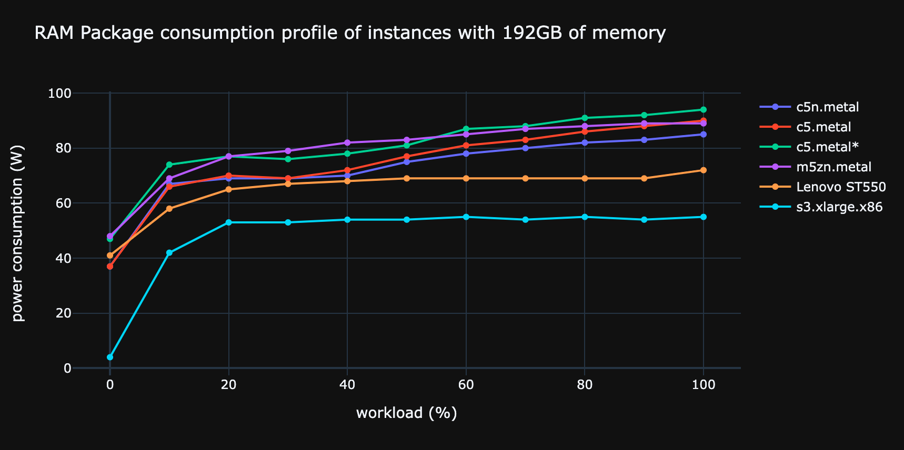

# RAM

## Characteristics

| Name             | Unit   | Default value (default;min;max)  | Description                           | Example |
|------------------|--------|----------------------------------|---------------------------------------|---------|
| units            | None   | 1                                | RAM strip quantity                    | 2       |
| usage            | None   | See Usage                        | See usage                             | ..      |
| capacity         | GB     | 32;1;128                         | Capacity of a ram strip               | 12      |
| density          | GB/cm2 | (avg;min;max) in our dataset     | Size of the die per Go of a ram strip | 1.25    |
| process          | nm     | None                             | Engraving process (Architecture)      | 25      |
| manufacturer     | None   | None                             | Name of the ram manufacturer          | Samsung |
| model            | None   | None                             | ..                                    | ..      |


## Complete

**The following variables can be [completed](../auto_complete.md)**

### density

if ```process``` or/and ```manufacturer``` are given, ```density``` can be retrieved from a fuzzy matching on our ram repository.
If several ram matches the given ```process``` or/and ```manufacturer``` the average value is given and min and max value are used as ```min``` and ```max``` fields.

## Embedded impacts

### Impacts criteria

| Criteria | Implemented | Source                                                                                                                                                         | 
|----------|-------------|----------------------------------------------------------------------------------------------------------------------------------------------------------------|
| gwp      | yes         | [Green Cloud Computing, 2021](https://www.umweltbundesamt.de/sites/default/files/medien/5750/publikationen/2021-06-17_texte_94-2021_green-cloud-computing.pdf) |
| adp      | yes         | [Green Cloud Computing, 2021](https://www.umweltbundesamt.de/sites/default/files/medien/5750/publikationen/2021-06-17_texte_94-2021_green-cloud-computing.pdf) |
| pe       | yes         | [Green Cloud Computing, 2021](https://www.umweltbundesamt.de/sites/default/files/medien/5750/publikationen/2021-06-17_texte_94-2021_green-cloud-computing.pdf) |
| gwppb    | no          |                                                                                                                                                                |
| gwppf    | no          |                                                                                                                                                                |
| gwpplu   | no          |                                                                                                                                                                |
| ir       | no          |                                                                                                                                                                |
| lu       | no          |                                                                                                                                                                |
| odp      | no          |                                                                                                                                                                |
| pm       | no          |                                                                                                                                                                |
| pocp     | no          |                                                                                                                                                                |
| wu       | no          |                                                                                                                                                                |
| mips     | no          |                                                                                                                                                                |
| adpe     | no          |                                                                                                                                                                |
| adpf     | no          |                                                                                                                                                                |
| ap       | no          |                                                                                                                                                                |
| ctue     | no          |                                                                                                                                                                |
| ctuh_c   | no          |                                                                                                                                                                |
| ctuh_nc  | no          |                                                                                                                                                                |
| epf      | no          |                                                                                                                                                                |
| epm      | no          |                                                                                                                                                                |
| ept      | no          |                                                                                                                                                                |

### Impact factors

For one RAM bank the embedded impacts are:

$$
\text{RAM}_\text{embedded}^\text{criteria} = (\text{RAM}_{\text{capacity}} / \text{RAM}_{\text{density}}) * \text{RAM}_\text{embedded_die}^\text{criteria} + \text{RAM}_\text{embedded_base}^\text{criteria}
$$

with:

| Constant                                      | Units       | Value      |
|-----------------------------------------------|-------------|------------|
| $\text{RAM}_\text{embedded_die}^\text{gwp}$   | kgCO2eq/cm2 | 2.20       |
| $\text{RAM}_\text{embedded_die}^\text{adp}$   | kgSbeq/cm2  | 6.30E-05   |
| $\text{RAM}_\text{embedded_die}^\text{pe}$    | MJ/cm2      | 27.30      |
| $\text{RAM}_\text{embedded_base}^\text{gwp}$  | kgCO2eq     | 5.22       |
| $\text{RAM}_\text{embedded_base}^\text{adp}$  | kgSbeq      | 1.69E-03   |
| $\text{RAM}_\text{embedded_base}^\text{pe}$   | MJ          | 74.00      |

!!!info
    If there are more than 1 RAM bank we multiply $\text{RAM}_\text{embedded}^\text{criteria}$ by the number of RAM bank given in `units`._


## Usage impact

Both [power consumption](../usage/power.md) and [consumption profile](../consumption_profile.md) are implemented.

## Consumption profile

The RAM consumption profile is of the form : ```consumption_profile(workload) = a * capacity```

As a first approximation, we use a uniform consumption profile since the stress test data used show a rather uniform
consumption. Consequently, the workload won't be used.



New stress test data specifically on RAM calls should be conducted to specify this consumption profile.

### Determining the parameters

To determine ```a``` we averaged the electrical consumption of RAM per GB. With the process we came up with ```a=0.284```

Capacity is either given by the user or the default value is used.

```consumption_profile(workload) = 0.284 * capacity```
