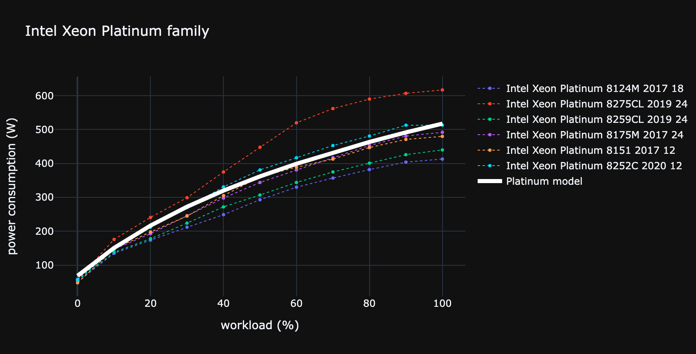

# Consumption profile

A consumption profile is a continuous function which links a workload with an electrical consumption :
```consumption_profile(workload) = power_consumption```

Consumption profile can be given by the user or be completed.
The completion strategy of the consumption profile is specified for each device or component when implemented.

Consumption profile is implemented for :

* [CPU](../components/cpu.md)
* [RAM](../components/ram.md)
* [SERVER](../devices/server.md)
* [CLOUD INSTANCES](../devices/cloud.md)


## Building consumption profile

We conduct stress test on different brand and range of components to gather punctual measurement...


